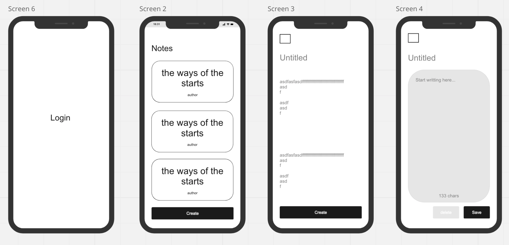
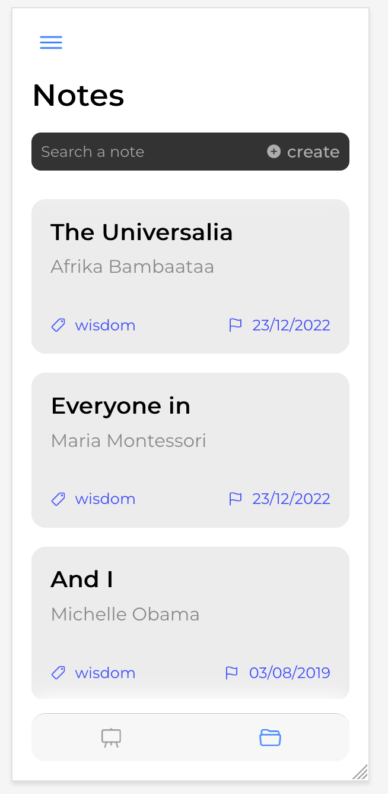

# NOTES APP PROJECT
This is a simple notes app project that allows users to create, read, update and delete notes on the firebase realtime database.

## Wireframes

## Getting Started
These instructions will get you a copy of the project up and running on your local machine for development and testing purposes.

#### Prerequisites
You need to have the following installed on your machine
* [Node.js](https://nodejs.org/en/download/)
* [ionic](https://ionicframework.com/docs/intro/cli)
  
#### Installing

* Clone the repository
* cd to the project directory
* Run `npm install` to install all dependencies
* Run `ionic serve` to start the development server

## How works
The app is using firebase realtime database to store the notes data and simulate local authentication. With reactive paradigm, we can implement the CRUD operations on the notes data.

The project also have the components approach to build the app. The components are reusable and can be used in other projects. But the components are not published to npm yet.

## Time management software
[Github Projects](https://github.com/users/sanchez-cristian-resources/projects/2/views/1)

## Project presentation
[Google slides](https://docs.google.com/presentation/d/1Wmg9JKaGU9BK-cR-nr3HMlVwiA68P8TSivYLbt1Nh6w/edit?usp=sharing)

## Final result

## Author
Cristian Sánchez.
I'm a frontend developer and I'm passionate about web development. I'm currently study microcomputer systems and networks in Bilbao Spain.
